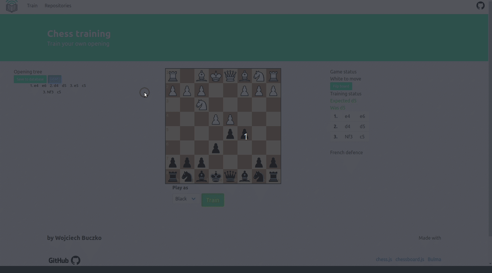
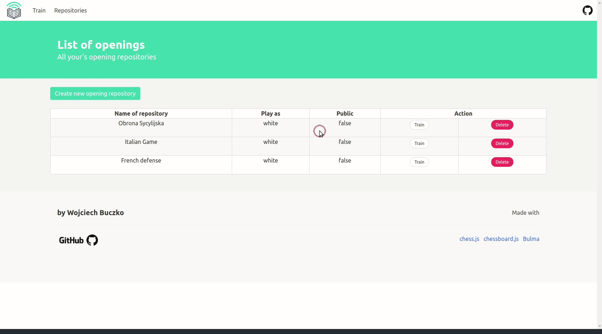

# Chess-openings-web-trainer
>The purpose of this project is to made a website that helps user learn chess openings.

## Used
+ [Maven](https://maven.apache.org/)
+ [Spring boot](https://spring.io/projects/spring-boot)
+ [Hibernate](https://hibernate.org/)
+ [Spring Security](https://spring.io/projects/spring-security)
+ [Spring Data](https://spring.io/projects/spring-data)
+ [Chess logic](https://github.com/jhlywa/chess.js/blob/master/README.md)
+ [Chessboard](https://chessboardjs.com/)
+ [Lombok](https://projectlombok.org/)
+ [ModelMapper](http://modelmapper.org/)
+ [Bulma](https://bulma.io/)

## To do
+ [x] Chessboard with logic
+ [X] Custom tree with own opening repositories saved in db
+ [X] Play with computer loaded game
+ [X] Load current playing opening name from database
+ [ ] User registration
+ [ ] User profile
+ [ ] Admin panel

## Training presentation

## Making tree presentation

